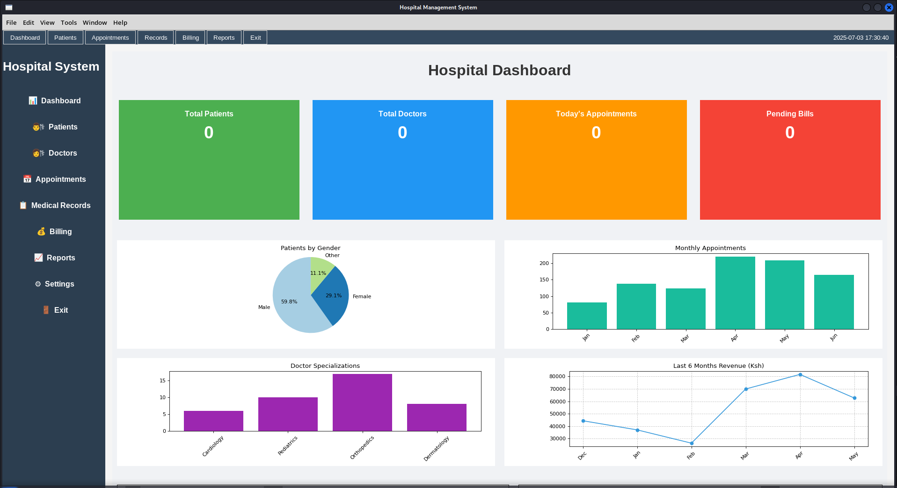

# Hospital Management System (HMS)

## Project Overview
The Hospital Management System is a comprehensive desktop application designed to streamline and automate various operations within a hospital environment. Built using Python and Tkinter, it provides an intuitive graphical user interface for managing patient records, doctor information, appointments, medical history, billing, and generating reports. The system aims to improve efficiency, reduce manual errors, and provide quick access to critical information.

## Features
* **Dashboard:** An interactive overview of key hospital statistics, including total patients, doctors, daily appointments, and pending bills, with graphical representations (pie charts, bar charts, line graphs).
* **Patient Management:**
    * Add, view, update, and delete patient demographic information.
    * Search for patients by various criteria.
    * View a patient's medical history and appointments.
* **Doctor Management:**
    * Add, view, update, and delete doctor profiles, including specialization and contact details.
    * Search for doctors.
* **Appointment Management:**
    * Schedule, view, update, and cancel patient appointments with doctors.
    * Filter and search appointments by date, patient, or doctor.
    * Update appointment statuses (e.g., Scheduled, Completed, Cancelled).
* **Medical Records:**
    * Record and manage patient diagnoses, treatments, prescriptions, and clinical notes.
    * Link records to specific patient-doctor encounters.
* **Billing System:**
    * Generate and manage patient bills for services rendered.
    * Track payment status (Pending, Partially Paid, Paid).
    * Search and filter bills.
* **Reports:**
    * Generate various reports (e.g., patient demographics, doctor workload, financial summaries, appointment trends).
* **Settings:** (Placeholder for future settings management)
* **Help Section:** (Placeholder for user guidance)
* **User-Friendly Interface:** Modern and responsive design using Tkinter's ttk widgets.

## Screenshots
*(Once your application is stable and fully functional, replace this section with actual screenshots of your dashboard, patient management, appointment scheduling, etc. This significantly enhances your README.)*




## Technologies Used
* **Python 3.x:** The core programming language.
* **Tkinter:** Python's standard GUI toolkit for creating the desktop application.
* **tkinter.ttk:** The themed Tkinter widgets for a more modern look and feel.
* **SQLite3:** A lightweight, file-based relational database for storing all application data.
* **Matplotlib:** Used for generating data visualizations (charts and graphs) on the dashboard.

## Setup and Installation

### Prerequisites
* Python 3.x installed on your system.

### Steps
1.  **Clone the repository:**
    ```bash
    git clone [https://github.com/](https://github.com/)[bonnymkuu]/HospitalManagementSystemPython.git
    cd HospitalManagementSystemPython
    ```
2.  **Create a Virtual Environment (Recommended):**
    A virtual environment isolates your project's dependencies from your system's global Python packages.
    ```bash
    python3 -m venv venv
    ```

3.  **Activate the Virtual Environment:**
    * **On Windows:**
        ```bash
        .\venv\Scripts\activate
        ```
    * **On macOS/Linux:**
        ```bash
        source venv/bin/activate
        ```

4.  **Install Dependencies:**
    Install all required Python packages using pip.
    ```bash
    pip install -r requirements.txt
    ```
   
## Running the Application
After installing dependencies and activating your virtual environment:

```bash
python main_menu.py